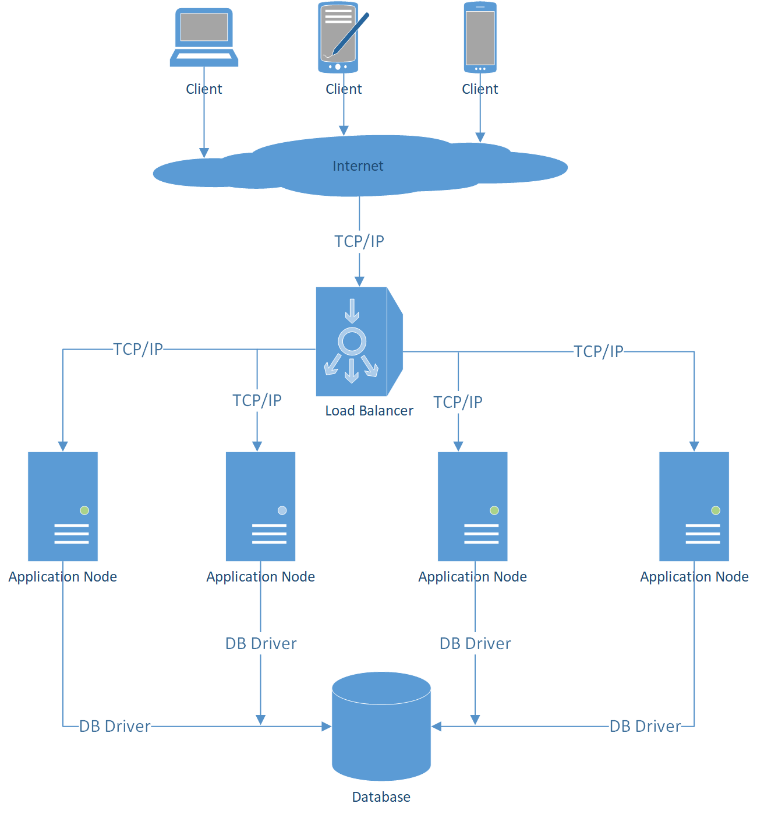
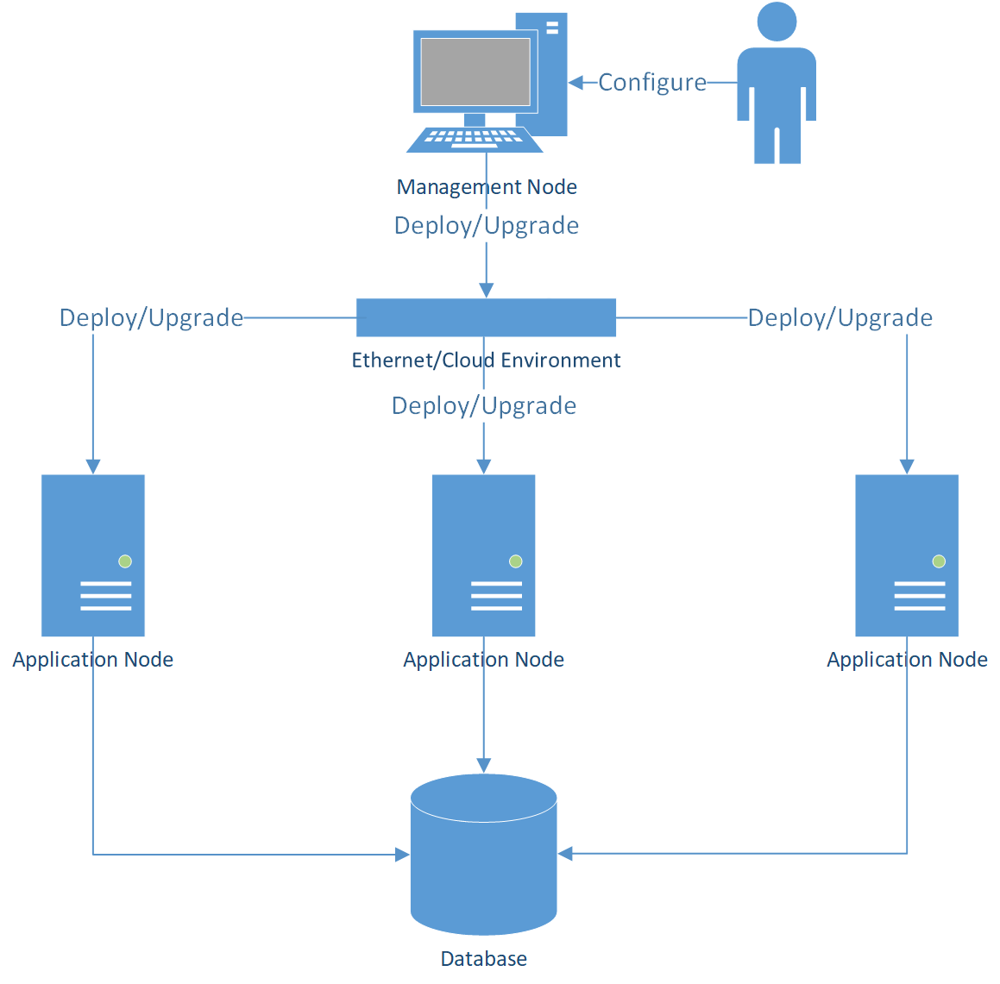

## Granite安装向导

### Granite简介

Granite是一个开源XMPP服务器，具有有以下特征：

* XMPP兼容。
* 高性能。
* 高可用。
* 跨平台。
* 高度模块化。
* 易于部署。

### 部署模式

Granite XMPP Server提供两种部署模式：

* ** Granite Lite **

使用Granite Lite部署模式，系统被部署在一个单节点（物理机、虚拟机、Docker）上，仅依赖JVM。

Granite Lite部署模式，适用于开发、测试环境，或者用于一些非关键应用场合（用户数量 < 1000，不强调系统的高可用性。）。

* ** Granite Cluster **

使用Granite Cluster部署模式，系统由多个节点组成，具备高可用性和高扩展性。

在严格的产品环境，我们总是推荐使用Granite Cluster部署版本，以保证系统的高性能、高可用及数据安全。

* ** 版本实现差异 **

Granite Lite和Granite Cluster部署版本，使用相同的通讯层和协议层实现，所以这两种部署形态对于客户端是完全透明的。

Granite Cluster部署版本实现了Session Manager、Cache Manager、Router、
Resource Service组件等的多节点共享版本，而Granite Lite部署版本相关实现为单节点版本。

Granite Cluster部署版本持久层采用MongoDB数据库，而Granite Lite部署版本使用一个嵌入式的数据库HSQL Server。

### Granite Lite部署

#### 前置准备

* ** 安装JDK或JRE **

Granite Lite依赖JDK 1.7+或者JRE 1.7+。你需要将JDK或者JRE先安装到系统中。

* ** 替换JCE策略文件 **

如果使用Oracke JDK或JRE，需要下载并替换JCE Policy文件。

JDK 7点击此处下载 [JCE强度无限制策略文件](http://www.oracle.com/technetwork/java/javase/downloads/jce-7-download-432124.html)

JDK 8点击此处下载 [JCE强度无限制策略文件](www.oracle.com/technetwork/java/javase/downloads/jce8-download-2133166.html)

下载后，解压zip文件，将local_policy.jar和US_export_policy.jar两个文件拷贝到$JAVA_HOME\jre\lib\security目录下并覆盖原有文件。

> ** 为何需要替换JCE策略文件 **

> * 美国政府限制高强度加密算法出口，高强度算法产品只能在美国本土和白名单国家下载。为避免违反相关法规，JCE强度无限制策略文件被拆分成独立的包下载。

> * Granite在生成服务器证书时，以及在使用TLS通讯时，会使用到受限制的高强度加密算法（例如：ASE-256）。

#### 下载

点击链接下载 [Granite Lite](http://www.firstlinecode.com/downloads/granite-lite-0.2.1.RELEASE.zip)

#### 安装

解压granite-lite-0.2.1.RELEASE.zip。

#### 检查

进入解压后的系统安装目录，运行以下启动命令：

```
java -jar org.eclipse.osgi-3.12.0.jar -console
```

启动OSGi后，可以在OSGi console里，运行granite services，检查services是否正常启动了。

```
g! granite services
```

如果看到以下的内容，说明Granite XMPP Server已经正常启动了。

```
g! granite services
id      State           Service ID
0       Available       stream.service
1       Available       processing.service
2       Available       routing.service
3       Available       event.service
4       Available       parsing.service
g!
```

可以在OSGi console中执行granite close命令，终止Granite XMPP Server运行。

```
g! granite close
```

#### 配置

* ** 配置文件 **

Granite的配置文件保存在$GRANITE_HOME/configuration/com.firstlinecode.granite下。包括以下配置文件：

* application.ini
* component-binding-lite.ini
* components.ini
* app-components.ini

|      文件名                        |                  说明         |
|-----------------------------------|-------------------------------|
| application.ini                   | 应用主配置文件                  |
| component-binding-lite.ini       | 组件依赖管理配置文件             | 
| components.ini                    | 组件参数配置文件                |
| protocol-plugins.ini              | 协议插件参数配置文件             |

* ** 配置Domain **

根据XMPP规范要求，每个XMPP Server必须指定Domain。用户可以在在application.ini中配置Domain：

```
domain.name=im.mydomain.com
```

> 如果你仅是在自己的局域网测试Granite Lite，并未注册Internet域名，可以将domain设置为服务器的IP地址。

如果我们使用MUC（Multi-User Chat）服务，还需要将MUC服务域名配置为domain.alias.names：

```
domain.alias.names=muc.im.mydomain.com
```

* ** 配置组件参数 **

可以在components.ini配置文件中，修改平台组件的参数。例如，我们需要修改XMPP Server启动端口号为6222（默认端口号为5222），可以在components.ini文件中socket.message.receiver章节，设置参数port：

```
[socket.message.receiver]
port=6222
```

* ** 配置协议插件参数 **

可以再protocol-plugins.ini配置文件中，修改协议插件的参数。例如，我们需要修改MUC服务的域名，可以在protocol-plugins.ini文件中xeps.muc章节，设置参数muc.domain.name：

```
[xeps.muc]
muc.domain.name=muc.im.mydomain.com
```

> ** 为何要区分组件配置和协议插件配置 **

> XMPP是一组协议族，包括RFC协议(例如：RFC3920、RFC3921)和XEPs(例如：XEP-0045 Multi-User Chat、XEP-0077 In-Band Registration)协议。在很多情况下，用户甚至可能会基于XMPP协议标准，定义自己的私有协议。

> Granite基于插件体系架构，在设计时，将系统拆分为两个域：平台域和应用域。

> * 平台域

> 实现系统的基础架构，例如：连接管理、Session管理、以及XMPP核心协议等。由一组基础平台实现插件组成。

> * 应用域 

> 是一组XMPP应用协议插件，例如：XEPs协议，以及用户自定义协议。

> 由于两个域所针对的问题不一样，组件模型采用了不同的设计方案，配置方式也有所差异。所以这两个域的参数分别在components.ini和protocol-plugins.ini中来配置。

> 关于平台域和应用域的更多信息，请参考[《Granite开发者手册》](http://www.firstlinecode.com/lithosphere/granite/docs/dev_guide.html)。

> 关于Granite Lite配置的更多信息，请参考[Granite用户手册](http://www.firstlinecode.com/lithosphere/granite/docs/user_guide.html)

### Granite Cluster部署

#### 概述

** Granite Cluster **

Granite Cluster提供了Granite Lite不具备的以下特性：

* 可扩展性

系统可以由一组节点组成，可以通过增加节点的方式，提升系统的性能。

* 高可用性

当系统中某些节点出现故障时，系统依然能够保障服务。



** 部署Granite Cluster **

为简化Granite Cluster的部署，系统被设计成集中式部署的模式。

* 管理节点(Management Node)

管理节点集中管理系统的配置、升级。管理节点包含了以下内容：

1 配置方案(Deploy Plan)

配置方案描述了集群的部署形态，包括应用节点类型、节点上部署的协议、数据库配置等。

配置方案是用户部署系统时主要使用的交互接口，用户通过维护配置方案来部署、升级Granite Cluster。

2 插件库(Plugins Repository)

Granite Cluster基于插件架构设计，系统功能模块被拆分打包成插件，用户可以按照实际的需求，选择需要部署的功能（插件），部署到应用节点上去。

管理节点的插件库里，包括了系统所有的可用插件，以满足多样化的部署方案。

3 部署器(Deployer)

部署器读取配置方案，根据配置方案生成应用节点的运行时。并提供下载服务，允许应用节点下载和部署运行时。

> 注：管理节点仅在系统部署期使用，当部署完成后，可以从系统中移除管理节点，这并不会影响系统对外提供的XMPP服务。

* 应用节点(Application Node)

应用节点是为系统提供XMPP服务的应用层组件。

应用节点在启动时，会连接到管理节点，检查部署方案是否有更新。如果应用节点并未部署运行时，或者部署方案有了更新，应用节点会根据部署方案，从管理节点下载合适的运行时并进行部署。

当运行时被正确部署后，应用节点启动运行时，正式成为集群中提供服务的节点。

部署期结束后，管理节点可能会被从系统中移除。应用节点在本地保存了部署方案和依赖的运行时，当应用节点重启时，会读取本地的部署方案和运行时，正确启动。



#### 安装Granite Cluster MgtNode

#####  前置准备

** 安装JDK或JRE **

Granite Cluster MgtNode依赖JDK 1.7+或者JRE 1.7+。你需要将JDK或者JRE先安装到系统中。

##### 下载

Granite Cluster MgtNode [点击下载](http://www.firstlinecode.com/downloads/granite-cluster-mgtnode-0.2.1.RELEASE.zip)

##### 安装

解压granite-cluster-mgtnode-0.2.1.RELEASE.zip。

##### 配置

Granite Cluster MgtNode的核心配置文件是$GRANITE_CLUSTER_MGTNODE_HOME/configuration/com.firstlinecode.granite/deploy-plan.ini，用户在此文件中定义系统的部署方案。

* ** 定义domain **
根据XMPP规范要求，每个XMPP Server必须指定Domain。用户可以在在deploy-plan.ini的cluster章节中配置Domain：

[cluster]
domain-name=im.example.com

> 如果你仅是在自己的局域网测试Granite Cluster，并未注册Internet域名，可以将domain设置为服务器的IP地址。

如果我们使用MUC（Multi-User Chat）服务，还需要将MUC服务域名配置为domain.alias.names：

```
domain.alias.names=muc.im.mydomain.com
```

* ** 选择部署协议 **

在app-node章节的设置XMPP服务支持的Protocol：

```
[app-node]
protocols=ibr, im, muc
```

* ** 设置数据库参数 **

Granite Cluster依赖MongoDB，假设我们已经安装了MongoDB，并创建了用户，需要在deploy-plan.ini的db章节配置数据库相关信息：

```
[db]
addresses=192.168.1.10:27017
db-name=granite
user-name=granite
password=mypassword
```


> 关于Granite Cluster部署方案配置的更多信息，请参考[Granite用户手册](http://www.firstlinecode.com/lithosphere/granite/docs/user_guide.html)

##### 检查

```
cd granite-cluster-mgtnode-0.2.1.RELEASE
java -jar granite-cluster-mgtnode-0.2.1.RELEASE.jar
```

正常启动后，可以看到类似以下的提示，说明MgtNode已经正常启动。

```
21:23:14.876 [main] INFO  c.c.g.cluster.node.mgtnode.Starter - Management node has joined the cluster.
21:23:15.376 [main] INFO  c.c.g.cluster.node.mgtnode.Starter - Starting console...
Commands:
help        Display help information.
exit        Exit system.
$
```

#### 安装Granite Cluster AppNode

#####  前置准备

** 安装JDK或JRE **

Granite Cluster AppNode依赖JDK 1.7+或者JRE 1.7+。你需要将JDK或者JRE先安装到系统中。

** 替换JCE策略文件 **

如果使用Oracke JDK或JRE，需要下载并替换JCE Policy文件。

JDK 7点击此处下载 [JCE强度无限制策略文件](http://www.oracle.com/technetwork/java/javase/downloads/jce-7-download-432124.html)

JDK 8点击此处下载 [JCE强度无限制策略文件](www.oracle.com/technetwork/java/javase/downloads/jce8-download-2133166.html)

下载后，解压zip文件，将local_policy.jar和US_export_policy.jar两个文件拷贝到$JAVA_HOME\jre\lib\security目录下并覆盖原有文件。

##### 下载

Granite Cluster AppNode [点击下载](http://www.firstlinecode.com/downloads/granite-cluster-appnode-0.2.1.RELEASE.zip)

##### 安装

解压granite-cluster-appnode-0.2.1.RELEASE.zip。

##### 检查

```
cd granite-cluster-appnode-0.2.1.RELEASE
java -jar granite-cluster-appnode-0.2.1.RELEASE.jar
```

AppNode会自动连接到MgtNode，下载部署方案和运行时，并且启动OSGi运行时。

启动OSGi后，可以在OSGi console里，运行granite services，检查services是否正常启动了。

```
g! granite services
```

如果看到以下的内容，说明Granite XMPP Server已经正常启动了。

```
g! granite services
id      State           Service ID
0       Available       stream.service
1       Available       processing.service
2       Available       routing.service
3       Available       event.service
4       Available       parsing.service
g!
```

可以在OSGi console中执行granite close命令，终止Granite XMPP Server运行。

```
g! granite close
```

#### 配置Load Balancer

理论上，可以使用任何支持TCP协议的Load Balancer，我们以gobetween([http://gobetween.io](http://gobetween.io/))为例。

##### 安装

下载并安装gobetween，并安装到负责Load Balancing的机器节点上。

##### 配置

假设Load Balancer主机地址如下：

* 192.168.1.101。

我们有3个AppNode地址如下：

* 192.168.1.102
* 192.168.1.103
* 192.168.1.104

我们需要修改${GOBETWEEN_HOME}/config/gobetween.toml配置文件，配置以下的内容：

[servers]

[servers.granite-cluster]
protocol = "tcp"
bind = "192.168.1.101:5222"
balance="roundrobin"

[servers.granite-cluster.discovery]
kind = "static"
static_list = [
	"192.168.1.102:5222",
	"192.168.1.103:5222",
	"192.168.1.104:5222"
]

##### 检查

使用以下命令启动Load Balancer：

```
gobetween -c ./config/gobetween.toml
```

现在Granite Cluster已经配置完成了，由于Granite是一个XMPP标准兼容的服务器实现，可以使用标准的XMPP客户端连接到192.168.1.101:5222，并测试其功能。

### 从源码构建

#### 前置准备

* ** 安装JDK或JRE **

Granite依赖JDK 1.7+或者JRE 1.7+。你需要将JDK或者JRE先安装到系统中。

* ** 安装Maven **

Granite依赖Maven进行构建。你需要将Apache Maven 3.3.9+先安装到系统中。

#### 构建Granite

##### 下载代码

```
git clone https://github.com/dongger1975/com.firstlinecode.granite.git
```

##### 构建所有插件

```
cd com.firstlinecode.granite
mvn clean install
```

##### 打包Granite Lite

```
cd com.firstlinecode.granite.pack/com.firstlinecode.granite.pack.lite
mvn clean package
cd target
java -jar com.firstlinecode.granite.pack.lite-0.2.1.RELEASE.jar
```

在target目录下会看到打包好的granite-lite-0.2.1.RELEASE.zip。

##### 打包Granite Cluster

* ** 打包MgtNode **

```
cd com.firstlinecode.granite.pack/com.firstlinecode.granite.pack.cluster.mgtnode
mvn clean package
cd target
java -jar com.firstlinecode.granite.pack.cluster.mgtnode-0.2.1.RELEASE.jar
```

在target目录下会看到打包好的granite-cluster-mgtnode-0.2.1.RELEASE.zip。

* ** 打包AppNode **

```
cd com.firstlinecode.granite.cluster/com.firstlinecode.granite.cluster.node/com.firstlinecode.granite.cluster.node.appnode
mvn clean package
```

在target目录下会看到打包好的granite-cluster-appnode-0.2.1.RELEASE.zip。
